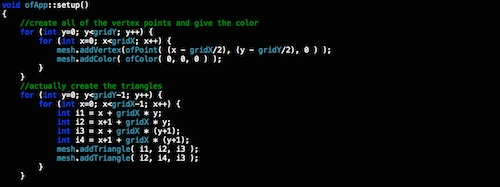
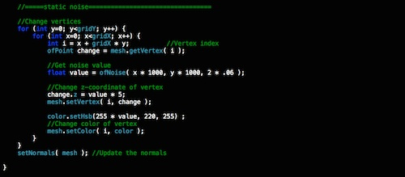
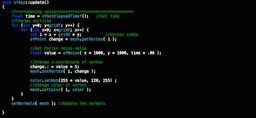
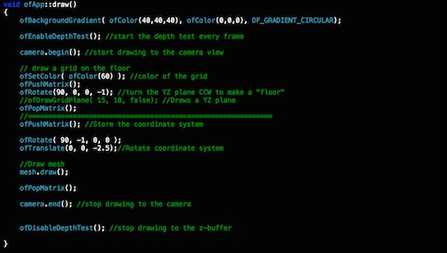

##3D Noise Exercise
Alex Esposito - 5/11/15

This code is a culmination of noise data being placed in to a 3D world in the code there is two forms of noise. one in setup which gives a static image and one in update which animates the same noise function for movement and color change

We start with actually creating the mesh of triangles through vertices.

Next is creating the static noise image

After that we use the same code only add time as a factor and put it in update in order to create animation

Lastly is the draw which actually draws the image up and down so a rotate handles putting it back on the floor plane

This code is created to better gain a handle on open frameworks and its many possibilities.

